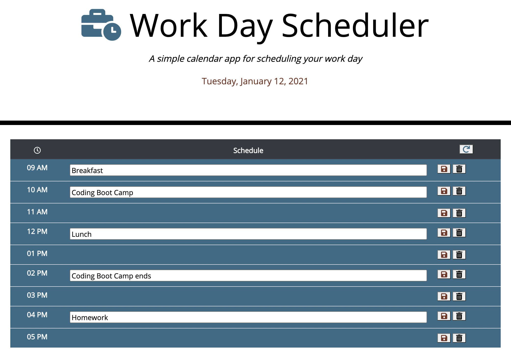

# MEMENTO MORI

A workday scheduler built with [jQuery](https://jquery.com/), [Bootstrap](https://getbootstrap.com/docs/4.3/getting-started/introduction/) and [Day.js](https://day.js.org/en/), using local storage to persist scheduled events.
<br><br>

`Some day you too, will die. Until then, enjoy. Or seize it. Or do whatever.`

<br>

Click on an hour to reveal a text input where you can describe an event. Click on save to store your scheduled activity for future reference. Click on delete to remove it. The scheduler will highlight hours past, present and future to help you plan your work day. Any unsaved events will be cleared to keep your calendar nice and organized.

Schedule meetings and other engagements in hour long chunks so that you can go eat a snack for 15 minutes before the next meeting. This scheduler isn't very granular - but that my friend, is a **feature!**

[Click here to get started.](https://stephenlprice.github.io/memento-mori/)

<br>



*Never again will you miss your deadlines or procrastinate. Thank me later. In fact put it on your calendar.*

<br>

## User Story

```
AS AN employee with a busy schedule
I WANT to add important events to a daily planner
SO THAT I can manage my time effectively
```


## Acceptance Criteria

```
GIVEN I am using a daily planner to create a schedule
WHEN I open the planner
THEN the current day is displayed at the top of the calendar
WHEN I scroll down
THEN I am presented with time blocks for standard business hours
WHEN I view the time blocks for that day
THEN each time block is color-coded to indicate whether it is in the past, present, or future
WHEN I click into a time block
THEN I can enter an event
WHEN I click the save button for that time block
THEN the text for that event is saved in local storage
WHEN I refresh the page
THEN the saved events persist
```
